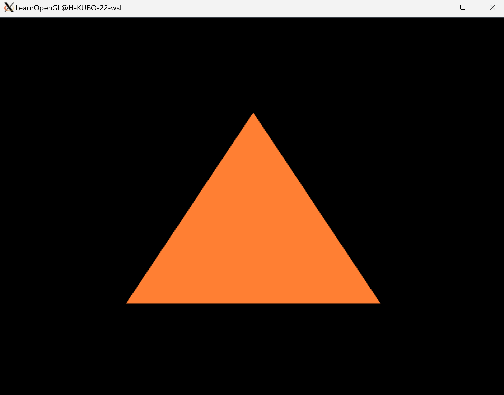
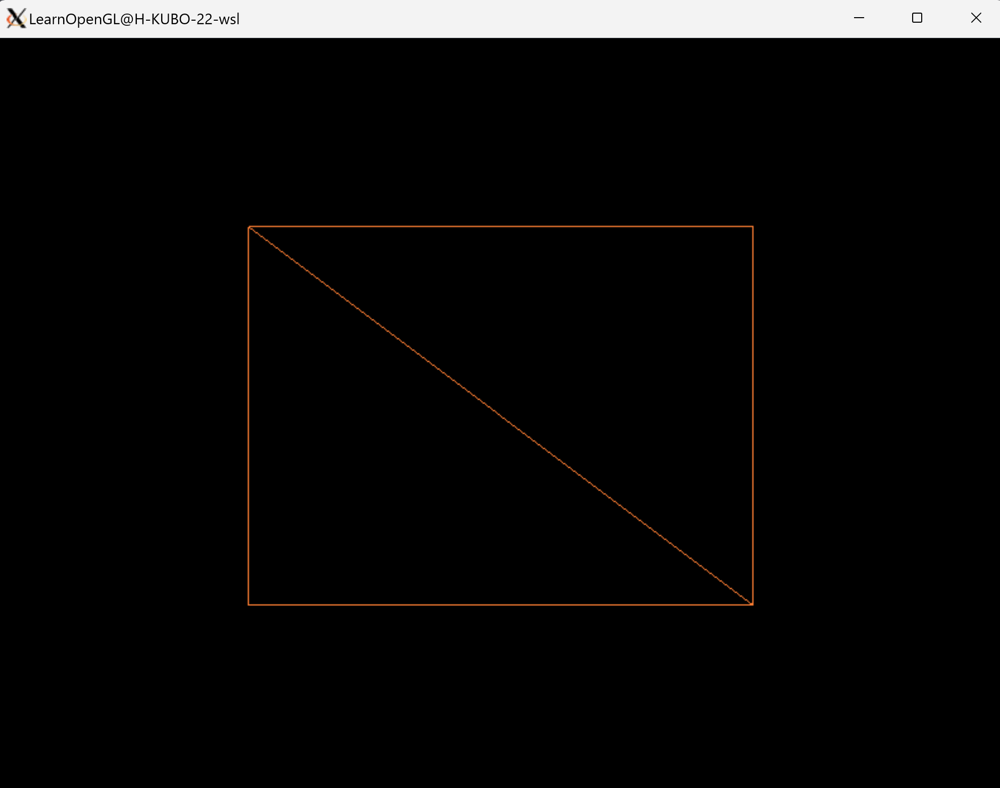
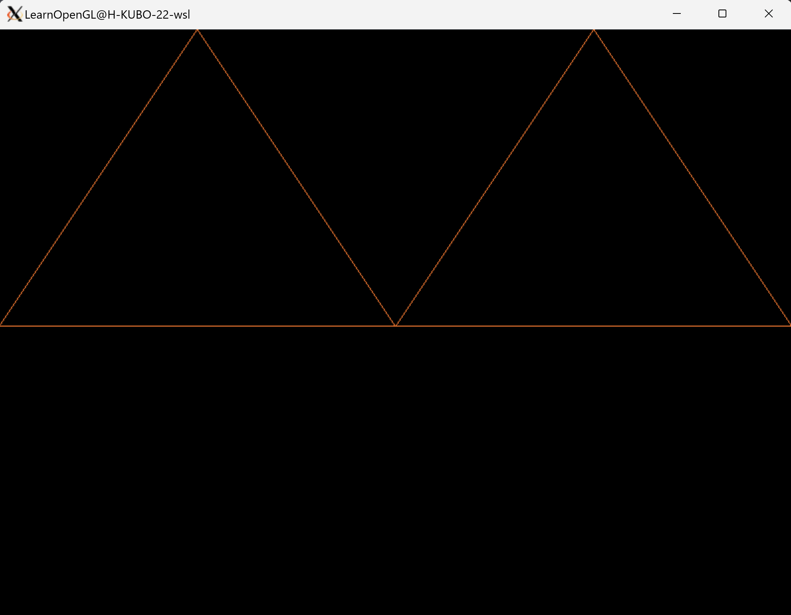

# Hello triangle
We can create a triangle by running follow command. You should rewrite `PARENT_DIR` in Makefile.

```bash
cd hello_triangle
make
./hello_triangle
```



<br></br>

We can create a rectangle with two triangles by running follow command. You should rewrite `PARENT_DIR` in Makefile.

```bash
cd hello_triangle_indexed
make
./hello_triangle_indexed
```



<br></br>

We can create two triangles by running follow command. You should rewrite `PARENT_DIR` in Makefile.

```bash
cd hello_two_triangles
make
./hello_two_triangles
```


