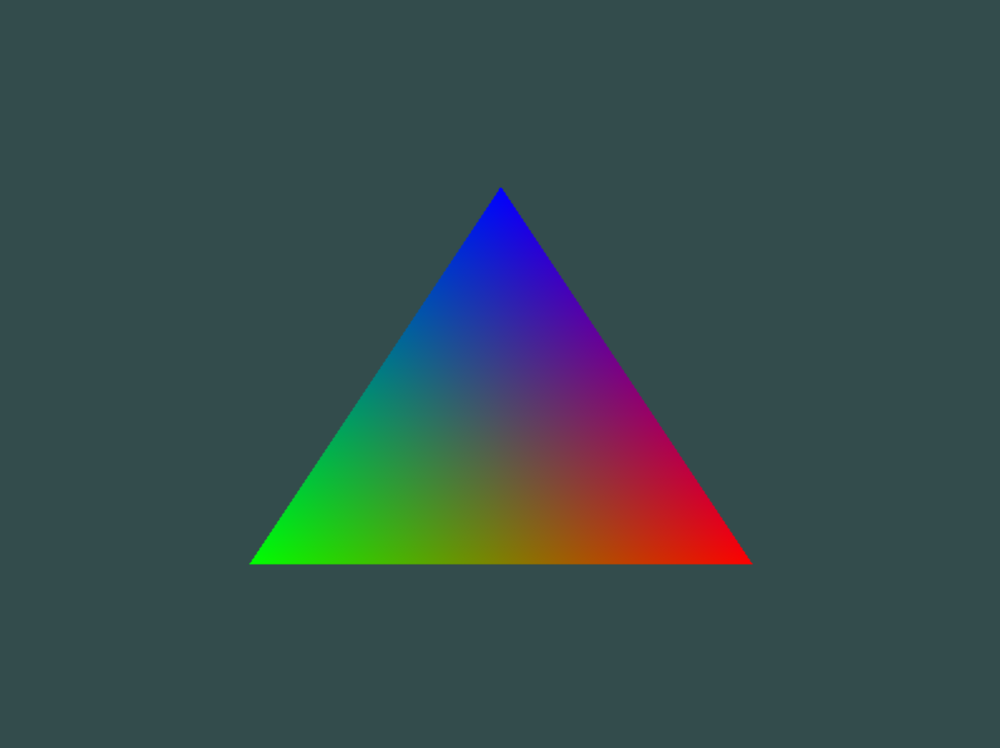

# Shaders
We can a triangle with interpolated colors between vertices.

```bash
cd interpolation
make
./interpolation
```



<br></br>

We can update colors and position by running follow command. You should rewrite `PARENT_DIR` in Makefile.

```bash
cd shader_ex_2
make
./shader_ex_2
```


