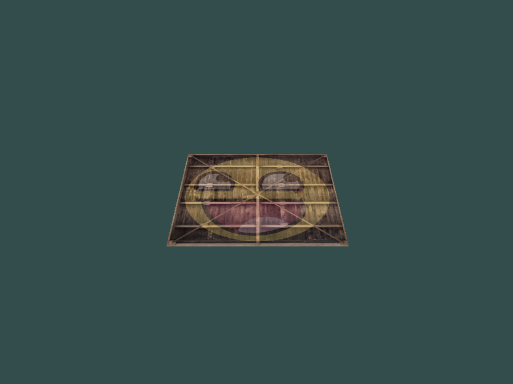

# Coordinate systems
We can transform coordinates.

```bash
cd coordinate_systems
make
./coordinate_systems
```



<br></br>

We can rotate a cube.

```bash
cd more_3d
make
./more_3d
```


<br></br>

We can rotate more cubes.

```bash
cd more_cubes
make
./more_cubes
```


