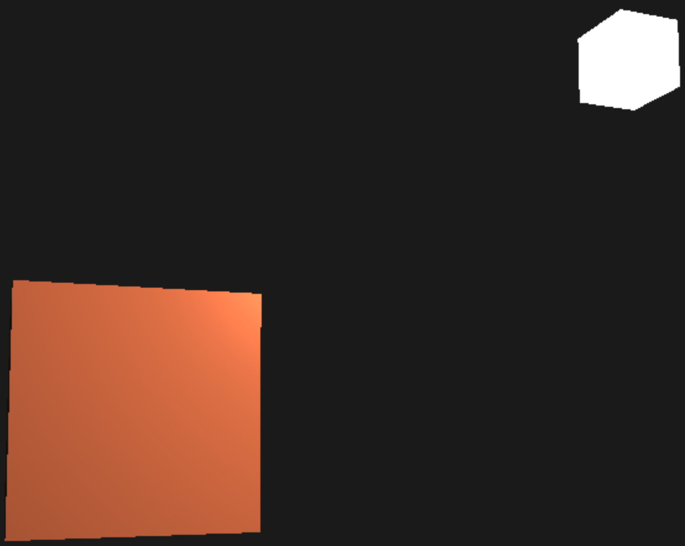

# Basic lighting
We can try the ambient lighting.

```bash
cd ambient
make
./ambient
```

<br></br>

We can try the diffuse lighting.

```bash
cd diffuse
make
./diffuse
```

<br></br>

We can try the specular lighting.

```bash
cd specular
make
./specular
```


