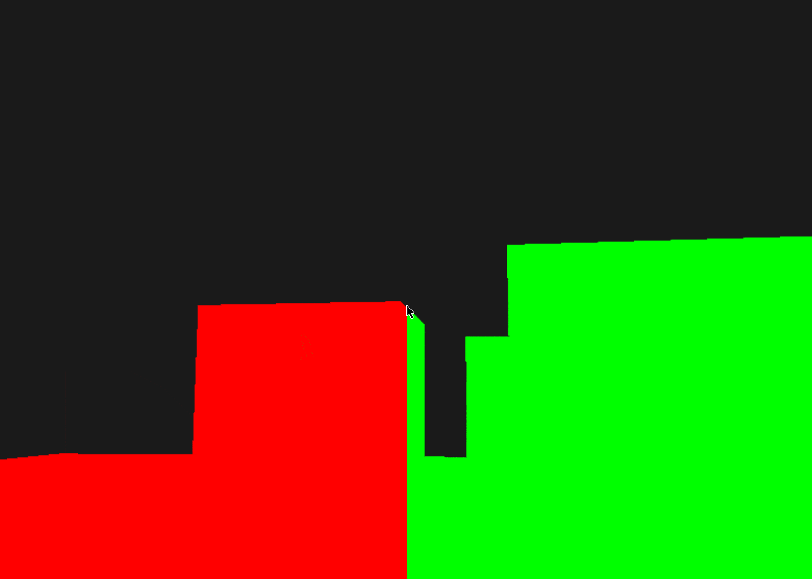
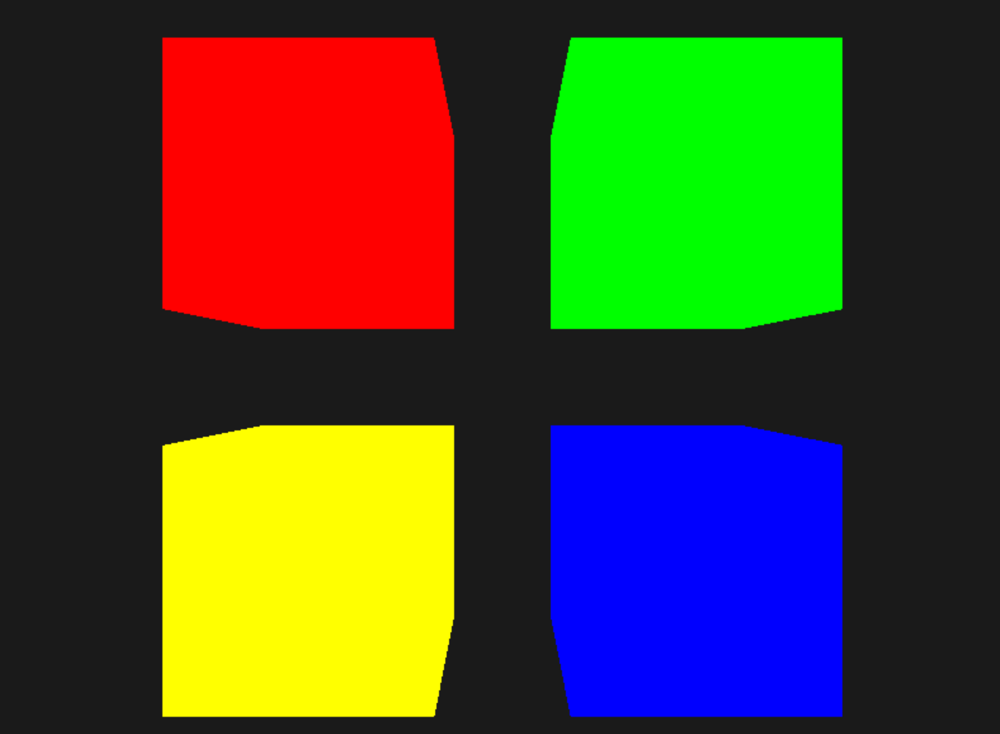

# Adavanced GLSL
We can now calculate two completely different fragment shader results and display each of them on a different side of the window by using gl_FragCoord. 

```bash
cd frag_coord
make
./frag_coord
```



<br></br>

We can try uniform buffers. Each of the cubes is moved to one side of the window by translating the model matrix and, thanks to the different fragment shaders, their colors differ per object. This is a relatively simple scenario of where we could use uniform buffer objects, but any large rendering application can have over hundreds of shader programs active which is where uniform buffer objects really start to shine.

```bash
cd ubo
make
./ubo
```


