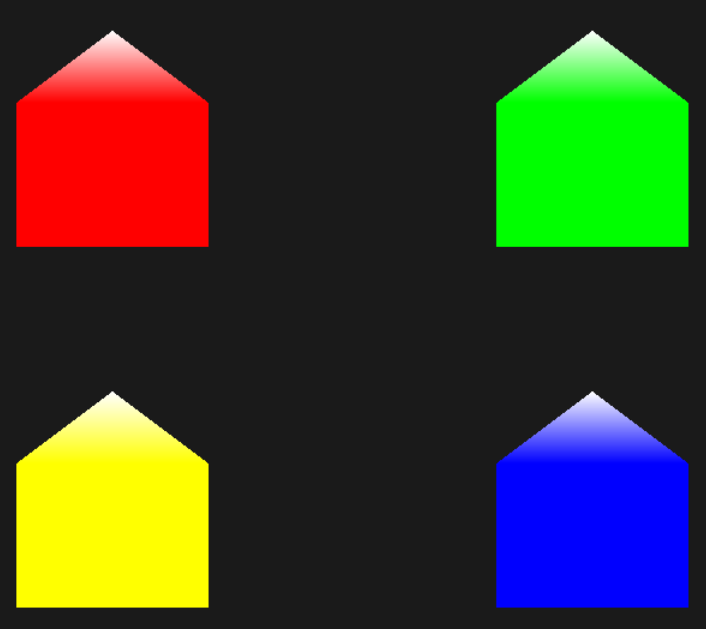

# Geometry Shader
Between the vertex and the fragment shader there is an optional shader stage called the geometry shader. A geometry shader takes as input a set of vertices that form a single primitive e.g. a point or a triangle. The geometry shader can then transform these vertices as it sees fit before sending them to the next shader stage. What makes the geometry shader interesting is that it is able to convert the original primitive (set of vertices) to completely different primitives, possibly generating more vertices than were initially given.

```bash
cd geo
make
./geo
```



<br></br>

When we say exploding an object we're not actually going to blow up our precious bundled sets of vertices, but we're going to move each triangle along the direction of their normal vector over a small period of time. The effect is that the entire object's triangles seem to explode.

```bash
cd exploding
make
./exploding
```


<br></br>

This time we're creating a geometry shader that uses the vertex normals supplied by the model instead of generating it ourself. To accommodate for scaling and rotations (due to the view and model matrix) we'll transform the normals with a normal matrix. The geometry shader receives its position vectors as view-space coordinates so we should also transform the normal vectors to the same space. This can all be done in the vertex shader:

```bash
cd normals
make
./normals
```


