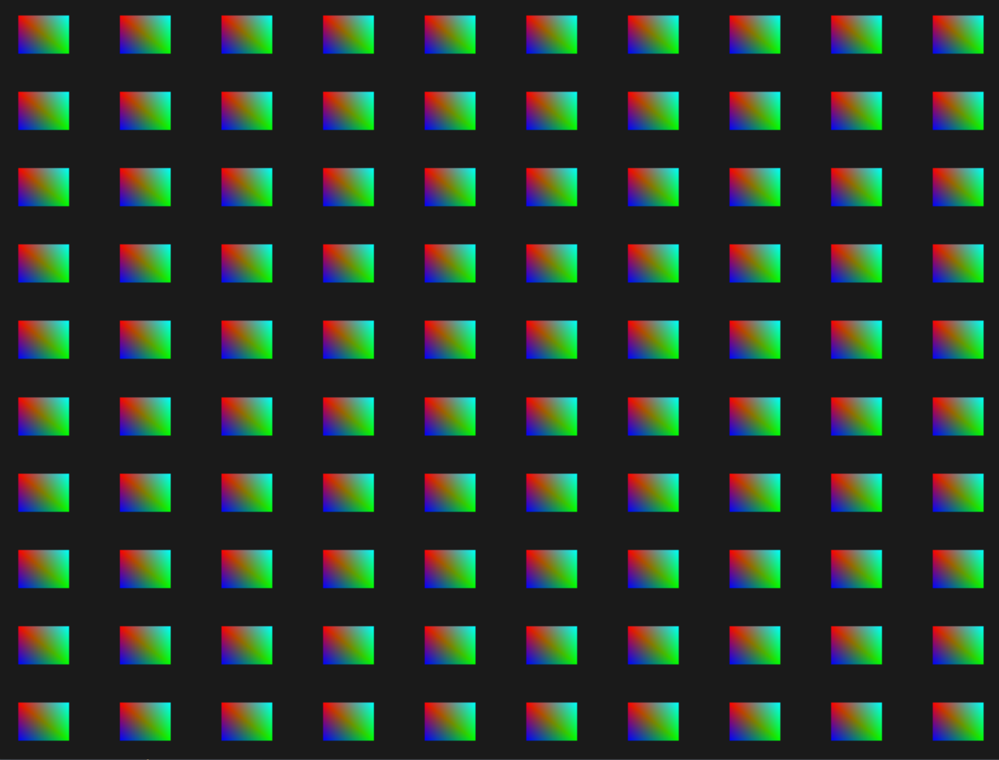

# Instancing
Say you have a scene where you're drawing a lot of models where most of these models contain the same set of vertex data, but with different world transformations. Think of a scene filled with grass leaves: each grass leave is a small model that consists of only a few triangles. You'll probably want to draw quite a few of them and your scene may end up with thousands or maybe tens of thousands of grass leaves that you need to render each frame. Because each leaf is only a few triangles, the leaf is rendered almost instantly. However, the thousands of render calls you'll have to make will drastically reduce performance.

To get a feel for instanced drawing we're going to demonstrate a simple example that renders a hundred 2D quads in normalized device coordinates with just one render call. We accomplish this by uniquely positioning each instanced quad by indexing a uniform array of 100 offset vectors. The result is a neatly organized grid of quads that fill the entire window:

```bash
cd instancing
make
./instancing
```



<br></br>

We can draw a natural-looking asteroid ring around a planet by using instancing.

```bash
cd asteroids
make
./asteroids
```


